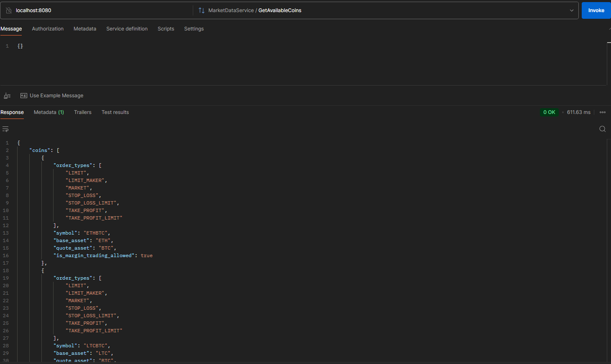
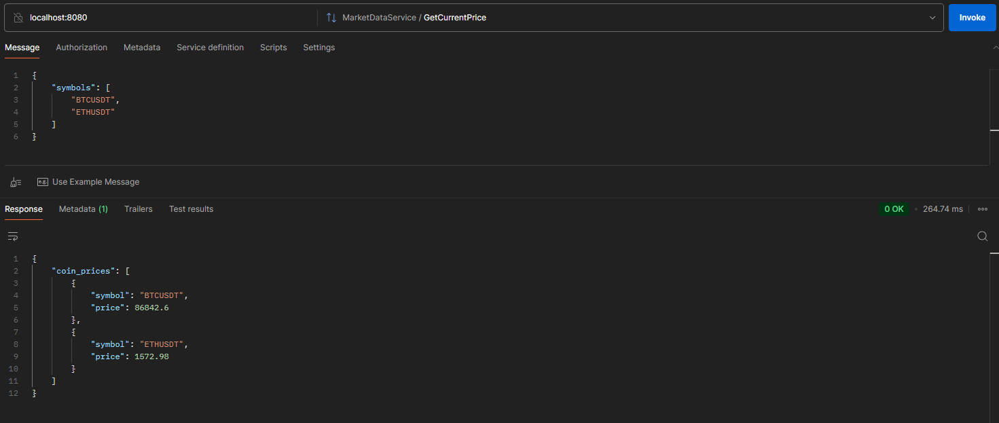
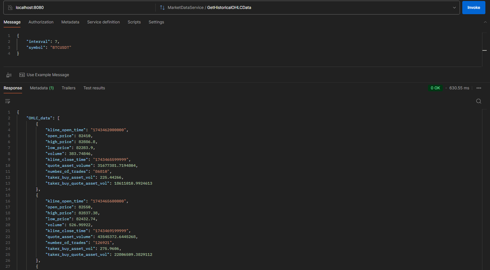
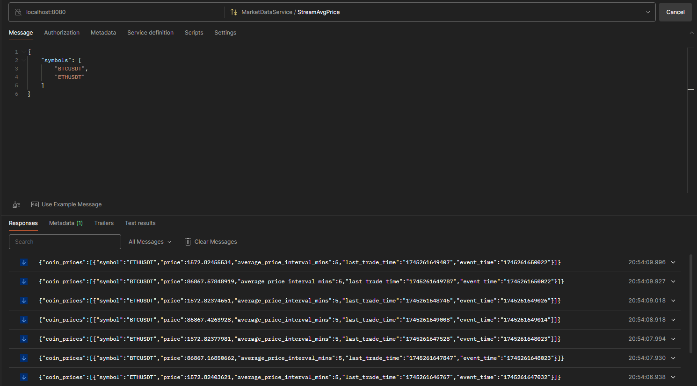
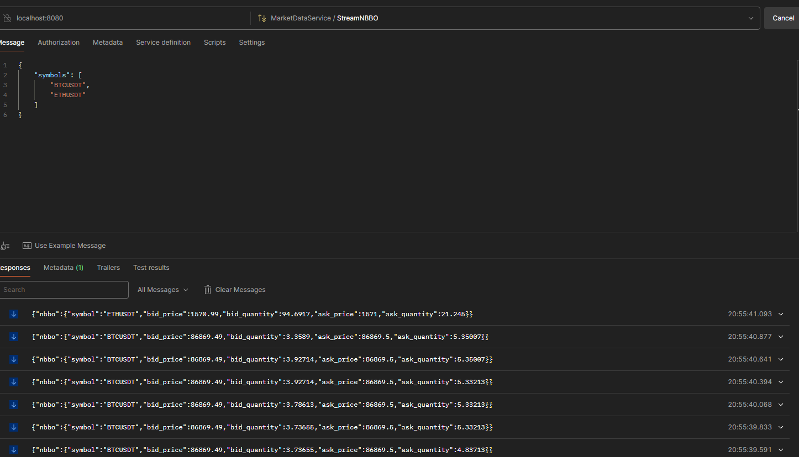

# TradeFlux

This project implements the gRPC conversion of some REST and websocket endpoints provided by Binance. REST API calls are implemented as unary RPC calls while websocket connections are implemented as server-side streaming.

> gRPC is a language-agnostic and fast protocol (it transmits data in binary format, not in text like REST). gRPC is generally used for server-to-server communication; for example, this Java code can be called by other backend services.
- `GetAvailableCoins`: List of available coins in Binance as well as some basic coin info. Uses `GET /api/v3/exchangeInfo`
- `GetCurrentPrice`: Latest price for a symbol or symbols. Uses `GET /api/v3/ticker/price`
- `GetHistoricalOHLCData`: Kline/candlestick bars for a symbol. Uses `GET /api/v3/klines`
- `StreamAvgPrice`: Average price streams push changes in the average price over a fixed time interval. WS Stream name: ` <symbol>@avgPrice`
- `StreamNBBO`: Pushes any update to the best bid or ask's price or quantity in real-time for a specified symbol. WS Stream name: `<symbol>@bookTicker`

## Prerequisites

Install JDK and maven:

```shell
sudo apt install openjdk-21-jdk
sudo apt install maven
```

The protoc compiler uses a plugin architecture for generating language-specific code:

1. **Base protoc compiler**: Handles parsing `.proto` files and general Protocol Buffer functionality
2. **Language plugins**: Generate language-specific serialization code (like Java classes)
3. **gRPC plugins**: Generate additional RPC-related code for services defined in the `.proto` files

For Java development, you need two components:

- The Java plugin (built into `protoc`) for basic message classes (used with `--java_out`)

```
sudo apt install protobuf-compiler
```

- The gRPC Java plugin for service interfaces and stubs (used with `--grpc-java_out`)

```
sudo apt-get install protobuf-compiler-grpc-java
```

To generate Java files from the `.proto` run:

```
protoc --experimental_allow_proto3_optional --java_out=<your_java_project> --grpc-java_out=<your_java_project> <your_proto_file>
```
Install `grpcurl` to interact with the gRPC server in the command line:
```
snap install grpcurl
```
### Note

If you're encountering an error like this when running the above `protoc` command try to install the plugin manually instead of using the package manager.

```
 protoc --experimental_allow_proto3_optional \
  --java_out=java/src/main/java \
  --grpc-java_out=java/src/main/java \
  grpc/tradeflux.proto
protoc-gen-grpc-java: program not found or is not executable
Please specify a program using absolute path or make sure the program is available in your PATH system variable
--grpc-java_out: protoc-gen-grpc-java: Plugin failed with status code 1.
```

When you run the `protoc` command with the `--grpc-java_out` flag, the protoc compiler looks for an executable named `protoc-gen-grpc-java` in your PATH. This executable is the actual plugin that generates the gRPC code for Java.

```shell
mkdir -p ~/bin
# adjust for your system architecture
wget https://repo1.maven.org/maven2/io/grpc/protoc-gen-grpc-java/<grpc_version>/protoc-gen-grpc-java-<grpc_version>-linux-x86_64.exe -O ~/bin/protoc-gen-grpc-java
chmod +x ~/bin/protoc-gen-grpc-java
echo 'export PATH="$HOME/bin:$PATH"' >> ~/.bashrc
source ~/.bashrc
```

## Quickstart

Start the Market Data server:

```
$ mvn exec:java -Dexec.mainClass="com.tradeflux.Main"
[INFO] Scanning for projects...
[INFO]
[INFO] -------------------------< com.tradeflux:java >-------------------------
[INFO] Building java 1.0-SNAPSHOT
[INFO] --------------------------------[ jar ]---------------------------------
[INFO]
[INFO] --- exec-maven-plugin:3.5.0:java (default-cli) @ java ---
Apr 21, 2025 9:47:49 PM com.tradeflux.Main main
INFO: Starting TradeFlux app...
Apr 21, 2025 9:47:49 PM com.tradeflux.MarketDataServerImpl start
INFO: Server started, listening on 8080
```

Send gRPC requests (other requests can be found in detail in the following chapter):

```
$ grpcurl -plaintext -proto grpc/tradeflux.proto -d '{}' localhost:8080 tradeflux.MarketDataService.GetAvailableCoins
{
  "coins": [
    {
      "symbol": "ETHBTC",
      "baseAsset": "ETH",
      "quoteAsset": "BTC",
      "orderTypes": [
        "LIMIT",
        "LIMIT_MAKER",
        "MARKET",
        "STOP_LOSS",
        "STOP_LOSS_LIMIT",
        "TAKE_PROFIT",
        "TAKE_PROFIT_LIMIT"
      ],
      "isMarginTradingAllowed": true
    },
  ...
  ]
}
```

## Testing with Postman
After starting the server (see previous chapter), you can call the gRPC endpoints from Postman. Make sure to select the gRPC request type and import the .proto file.

### `GetAvailableCoins`
Request: `{}`


### `GetCurrentPrice`
Request: 
```
{
    "symbols": [
        "BTCUSDT",
        "ETHUSDT"
    ]
} 
```


### `GetHistoricalOHLCData`
Request: 
```
{
    "interval": 7,
    "symbol": "BTCUSDT"
}
```



### `StreamAvgPrice`
Request: 
```
{
    "symbols": [
        "BTCUSDT",
        "ETHUSDT"
    ]
} 
```

### `StreamNBBO`
Request: 
```
{
    "symbols": [
        "BTCUSDT",
        "ETHUSDT"
    ]
} 
```



Note: Since this Binance WS stream pushes data in real time, you might experience that after cancelling the stream in Postman, you're still getting updates. This is because of the amount of data - Postman buffers the previous data and displays all of it after cancelling the stream. This is expected Postman behavior.

## References
- https://github.com/binance/binance-spot-api-docs/blob/master/rest-api.md
- https://github.com/binance/binance-spot-api-docs/blob/master/web-socket-streams.md
- https://github.com/fullstorydev/grpcurl
- https://protobuf.dev/
